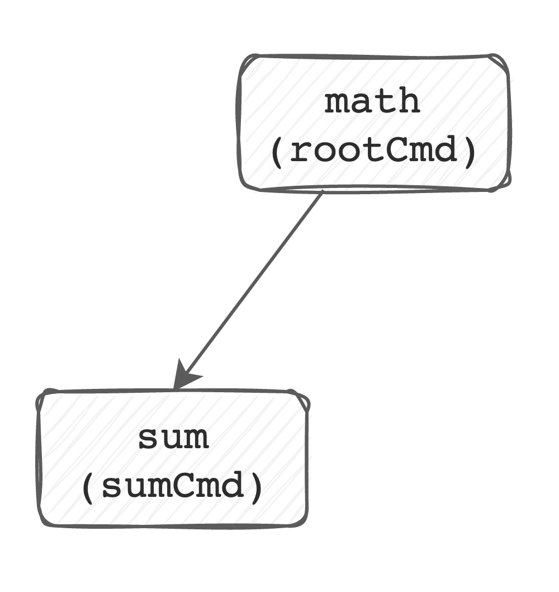

# Adding a subcommand

So now lets add an easy subcommand - `sum`, to make our CLI function like this:

```shell
math sum 1 2 3
>6
```

We'll use `cobra-cli` to `add` a new subcommand to the `rootCmd`, and save us
from having to write out the new `*cobra.Command` ourselves. Run this from the
root of your source code repository.

```
cobra-cli add sum
```

You should now see a new file, `cmd/sum.go`, in place:


```
.
├── LICENSE
├── cmd
│   ├── root.go
│   └── sum.go  <-- new!
├── go.mod
├── go.sum
├── main.go
└── math
```

Open this file, and take a look at the `init()` function declaration:

```go
func init() {
	rootCmd.AddCommand(sumCmd)
}
```

This is where we start building our tree of commands. Here we've taken `rootCmd`
and added the new `sumCmd` to it as a subcommand. Our tree looks something like
this:




If you build and run your project now, you'll see our help output has changed.

```
$ go build -o math . && ./math
Execute fun math functions

Usage:
  math [command]

Available Commands:
  completion  Generate the autocompletion script for the specified shell
  help        Help about any command
  sum         A brief description of your command

Flags:
  -h, --help     help for math
  -t, --toggle   Help message for toggle

Use "math [command] --help" for more information about a command.
```

We now have our `sum` command with its (`Short`) description, as well as some
flag definitions (more to come on those later, it was scaffolded by `cobra-cli`
and I've ignored it so far), and generic subcommands like `help`. You now also
see a `Usage` statement.

Now, you can also run the `math sum` command. Try that now.

```
$ ./math sum
sum called
```

## Practice:

If you're following along, go ahead and practice what we did with the root
command: Change the Short and Long descriptions for the `sumCmd` to indicate
that we will take an arbitrary number of integers and return the sum of their
values.

