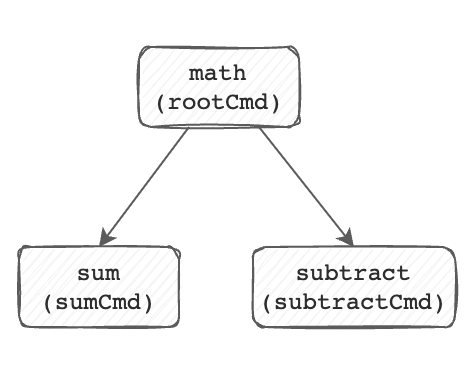
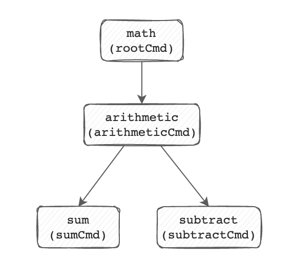

# Adding subcommands to subcommands

So far, we've add the `subtract` and `sum` subcommands to the `math` root
command. But it's possible to also add subcommands to other subcommands. 

Let's build a subcommand that logically groups `subtract` and `add`, called
`arithmetic`. Let's break out `cobra-cli` to build out the base subcommand
`arithmetic`. 

```
$ cobra-cli add arithmetic
arithmetic created at /Users/me/.go/src/github.com/opdev/cobra-primer/math
```

With this in place, let's go ahead and disable the Run function so that calling
`math arithmetic` just displays help output. 

```go
var arithmeticCmd = &cobra.Command{
	Use:   "arithmetic",
	Short: "basic arithmetic functions",
}
```

To move `sum` and `subtract` to be organized under `arithmetic` instead of the
root command `math`, just open `sum.go` and `subtract`.go to their `init()`
functions, and replace `rootCmd.AddCommand` with `arithmeticCmd.AddCommand`. 

Here's what `subtract.go`'s init function looks like now:

```go
func init() {
	arithmeticCmd.AddCommand(subtractCmd)
	subtractCmd.Flags().BoolP("invert-sign", "i", false, "inverts the sign of the result.")
}
```

And our command "tree" went from this:



to this:




And our commands are logically grouped with the `arithmetic` subcommand:

```shell
$ go build . && ./math arithmetic --help
basic arithmetic functions

Usage:
  math arithmetic [command]

Available Commands:
  subtract    subtract integers
  sum         add integers

Flags:
  -h, --help   help for arithmetic

Use "math arithmetic [command] --help" for more information about a command.
```

If you were scaffolding a net-new command using `cobra-cli` and you wanted it
organized under some command OTHER than the root command, you can pass the
`--parent` flag to `cobra-cli` which will organize the new command under the new
parent.
