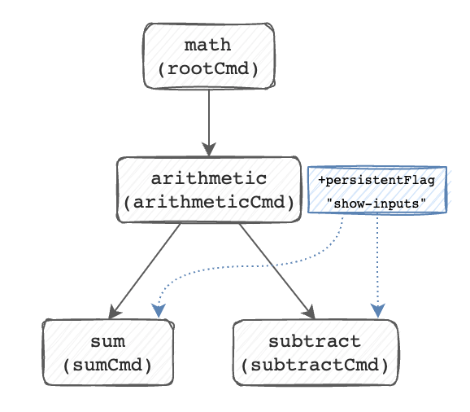

# Adding persistent flags

At this point, we have multiple levels of commands. What if we want a common
flag across all levels of subcommands? Let's implement a `--show-inputs` flag that
prints our inputs like so:

```shell
# math arithmetic sum --show-inputs 1 2
1+2=3

# math arithmetic subtract --show-inputs 1 2
1-2=-1
```

We could add this flag as a `BoolP` to both the `subtractCmd` and the `sumCmd`,
but we should instead bind it to the `arithmeticCmd` as a **PersistentFlag**.

If you still have the comments scaffolded in the `init()` func by `cobra-cli`
for the `cmd/arithmetic.go` file, you might see this line here:

```go
func init() {
    // ... omitted
	// arithmeticCmd.PersistentFlags().String("foo", "", "A help for foo")
    // ... omitted
}
```

A **PersistentFlag** is one that is passed along to child subcommands. Whereas a
**Flag** on `arithmeticCmd` would not be passed down to `sumCmd` or
`subtractCmd`, a **PersistentFlag** is made available to both of them.

Uncomment this line and make it a BoolP flag called `show-inputs`, with
shortflag `s`. Note: Making this a BoolP may require adding a parameter to the
function call!

```go
// ... the rest of the code

func init() {
	rootCmd.AddCommand(arithmeticCmd)
	arithmeticCmd.PersistentFlags().BoolP("show-inputs", "s", false, "whether to print inputs")
}
```

Build and run `math arithmetic` to see the flag is now configured.

```shell
$ go build . && ./math arithmetic --help
basic arithmetic functions

Usage:
  math arithmetic [command]

Available Commands:
  subtract    subtract integers

Flags:
  -h, --help          help for arithmetic
  -s, --show-inputs   whether to print inputs       # here it is!

Use "math arithmetic [command] --help" for more information about a command.
```

Run the `math arithmetic subtract` command with the `--help` flag to see it
listed there as a Global Flag:

```
$ go build . && ./math arithmetic subtract --help
subtract integers

Usage:
  math arithmetic subtract [flags]

Flags:
  -h, --help          help for subtract
  -i, --invert-sign   inverts the sign of the result.

Global Flags:
  -s, --show-inputs   whether to print inputs
```

If you run just the `math` command, you'll notice that the flag is missing!

```
$ go build . && ./math --help
Execute fun math functions

Usage:
  math [command]

Available Commands:
  arithmetic      basic arithmetic functions
  completion      Generate the autocompletion script for the specified shell
  help            Help about any command

Flags:
  -h, --help     help for math
  -t, --toggle   Help message for toggle

Use "math [command] --help" for more information about a command.
```

So the flag is available at subcommands _below_ where it is defined as shown here:



Accessing the persistent flag declared in the `arithmeticCmd` has a bit of a trick to it! 

When accessing the value from the `sumCommandRunE`, for example, we will still
call `cmd.Flags()` and NOT `cmd.PersistentFlags()`. This is because
`cmd.PersistentFlags()` only returns that specific command's persistent flags.
To see all flags that apply to the command you are developing, you only need to
call `cmd.Flags()`. 

```go
func sumCommandRunE(cmd *cobra.Command, args []string) error { // return an error
    // .. this code is unchanged ..

	showInputs, _ := cmd.Flags().GetBool("show-inputs")
	if showInputs {
		fmt.Fprintf(cmd.OutOrStdout(), "%s\n", strings.Join(args, "+"))
	}

	fmt.Fprintln(cmd.OutOrStdout(), sum(values...))

	return nil
}
```

We see this output after we build and run the new `math` binary:

```
$ go build . && ./math arithmetic sum --show-inputs 2 3
Command "sum" is deprecated, This command will be replaced by the "addition" command in the next release
2+3
5
```
